- Research Paper of This Project --> [PhishShield](https://github.com/The-Real-Virus/Research-Papers)  

# 🛡️PhishShield🛡️  

> [!IMPORTANT]
> This is FYP a Research based project along with a research paper and this product.  
> The Journey was quite long and complex, So the folder "Development-Data-Process" contains only & all the necessary material used to develop V3.0.

# How to Use ?
1) Open Chrome and Click on Extention.  
     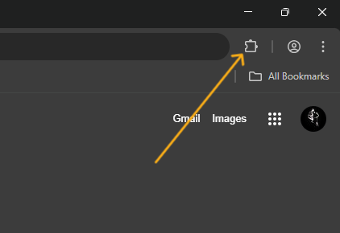

2) Go to manage extention.  
     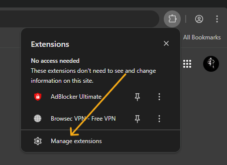

3) Turn on developer mode.  
     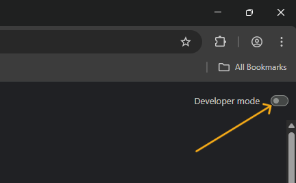

4) Select load unpack.  
     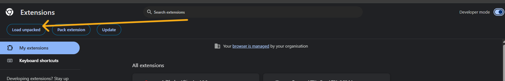

5) Select the PhishShield folder from where u download/clone it.  
     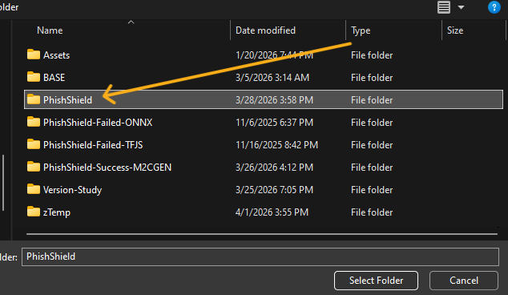

6) You will see the PhishShield in ur extentions.  
     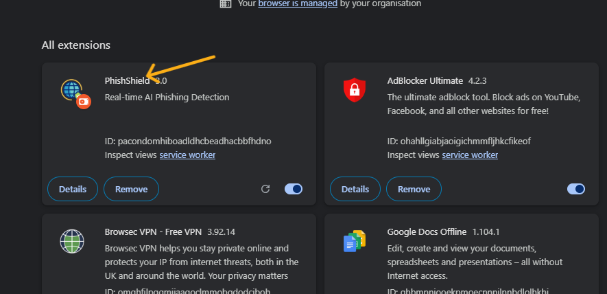

7) You can interact with it from the icon.  
     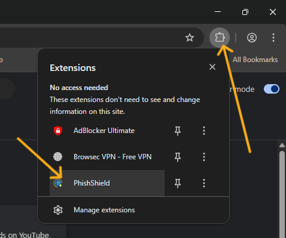

8) First interface.  
     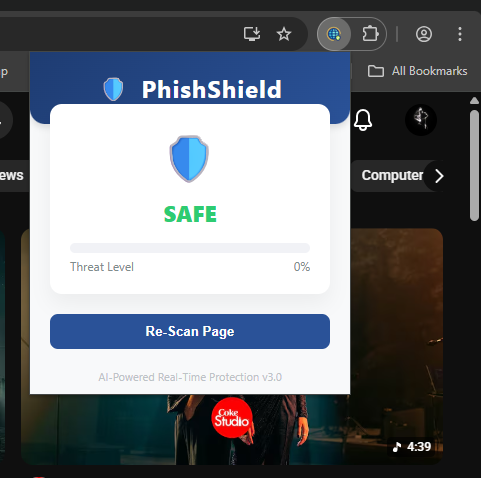

# Interface
1) Phish.  
     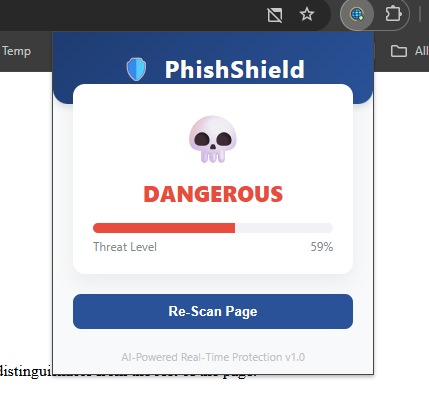

2) Popup.  
     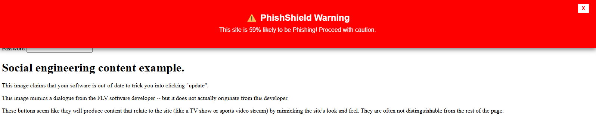

3) Safe.  
     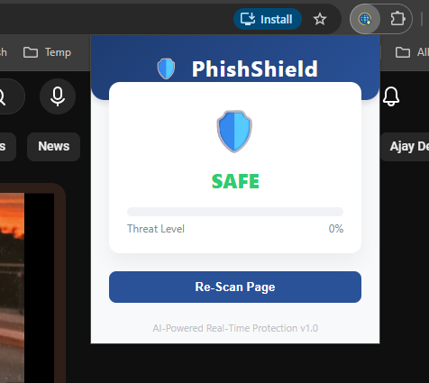

4) Scan.  
     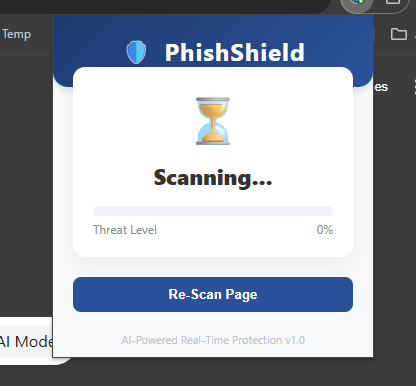

# Banner & Logo
1) Banner.  
     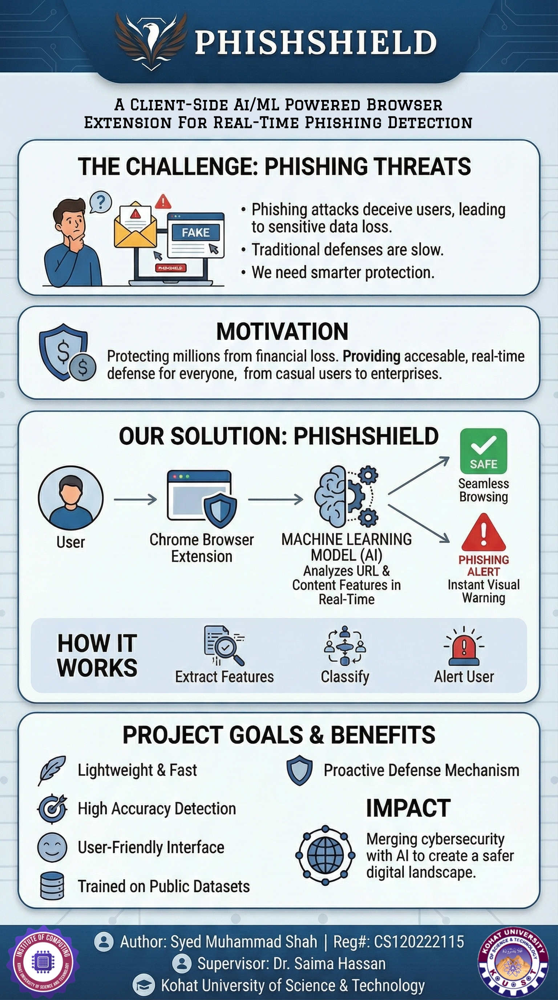

2) Logo 1.  
     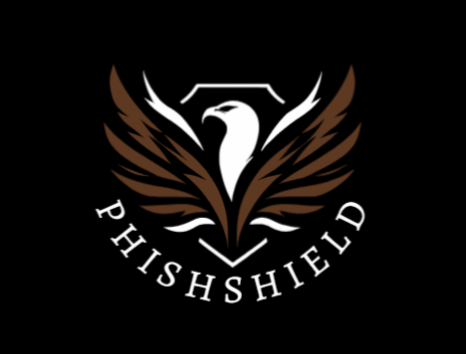
   
2) Logo 2.  
     

## License
This project is licensed under the **MIT License**.
Copyright (c) [2026] [The-Real-Virus]
For more details, see the [LICENSE](LICENSE) file.

# Disclaimer ⚠️
**Educational, Research & Informational Purposes Only:** This extension is provided as a tool to assist in identifying potential phishing threats. It is not an absolute guarantee of security. 

**No Liability:** While we strive for accuracy, phishing techniques evolve rapidly. The developers assume no responsibility for:
*   Any damages or data loss resulting from undetected phishing sites.
*   The accidental blocking or flagging of legitimate websites.
*   Any actions taken by the user based on the extension's alerts.

**User Responsibility:** Users should always exercise caution when entering sensitive information online and should not rely solely on this extension for their cybersecurity. Use of this software is at your own risk.
